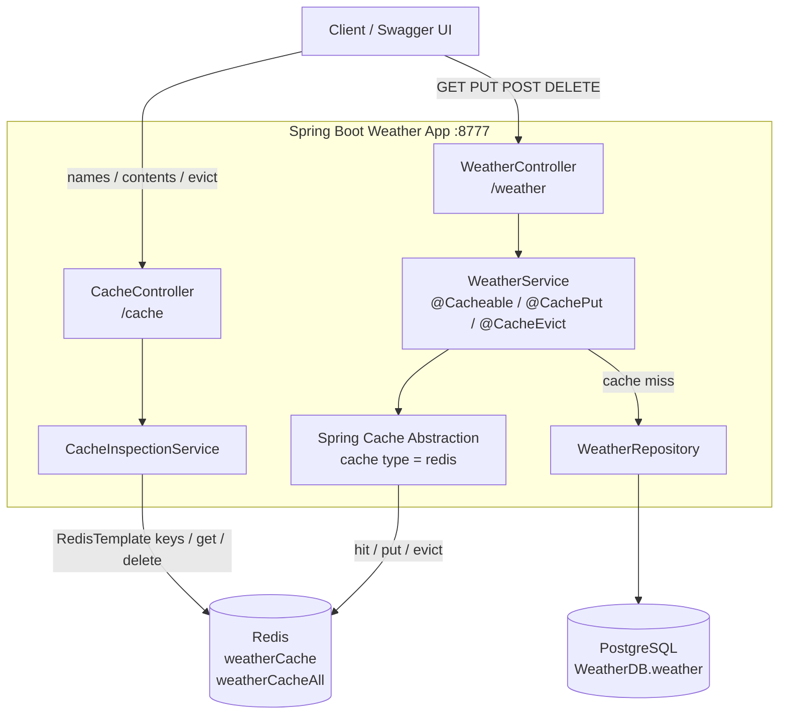

# 🌦️ Weather App with Spring Boot Caching

## 🚀 Introduction
This project demonstrates the implementation of **caching mechanisms** in a **Spring Boot** application using both **in-memory caching (ConcurrentHashMap)** and **Redis**. The application provides a RESTful API to manage weather data and leverages caching to optimize performance and reduce database queries.

---

## 🧭 Architecture

Clients call two REST surfaces. Weather reads and writes go through Spring Cache (`@Cacheable`, `@CachePut`, `@CacheEvict`) and land in Redis. A cache miss falls through to PostgreSQL. Cache inspection talks to Redis directly.



**Read path.** `GET /weather/{city}` is cached in `weatherCache` with the city as the key. A hit returns from Redis. A miss loads the row from PostgreSQL and stores it as `weatherCache::{city}`. `GET /weather` uses `weatherCacheAll`.

**Write path.** `POST` and `PUT` refresh `weatherCache` with `@CachePut`. `DELETE /weather/{city}` drops that key with `@CacheEvict`. Startup clears both caches via `CacheInitializer`.

---

## 🔥 What is Caching?
Caching is a technique that **stores frequently accessed data in memory** to improve performance and reduce latency. Instead of fetching data from the database on every request, caching allows retrieval from a faster storage layer.

### ✅ **Advantages of Caching**:
✔️ Reduces database load and improves response time.
✔️ Enhances application scalability.
✔️ Minimizes network latency.

### ❌ **Disadvantages of In-Memory Caching**:
⚠️ Limited by RAM size, leading to potential memory exhaustion.
⚠️ Data loss on application restart (unless persisted in external storage).
⚠️ Not suitable for distributed applications without additional configurations.

---

## 🏗️ Types of Caching Used in This Project

1️⃣ **In-Memory Caching** 🛑: Uses Java’s **ConcurrentHashMap** via `@Cacheable` to store frequently accessed data within the application’s memory.

2️⃣ **Redis Caching** 🔥: Stores cache data in **Redis**, a high-performance, distributed in-memory datastore. It provides **persistence, eviction policies, and better scalability**.

---

## 🛠️ Technologies Used

| Technology  | Purpose |
|------------|----------|
| 🟢 **Spring Boot**  | Framework for backend services |
| 🗄️ **Spring Cache Abstraction** | Built-in caching mechanism |
| 🔥 **Redis**  | Distributed caching solution |
| 🔵 **Spring Data Redis** | Redis integration with Spring |
| 📜 **Swagger (OpenAPI)** | API documentation |
| 🛢️ **PostgreSQL** | Database for persistent storage |

---

## 📂 Project Structure
```
├── src/main/java/com/weather
│   ├── controller/       # REST controllers
│   ├── service/          # Business logic layer
│   ├── entity/           # Data model
│   ├── repository/       # Data access layer
│   ├── config/           # Configuration files
│   ├── WeatherApplication.java   # Main application entry point
```

---

## 🌍 API Endpoints
### 🌤️ **Weather Controller**
- `GET /weather/{city}` - Fetch weather data for a city.
- `PUT /weather/{city}` - Update weather data for a city.
- `DELETE /weather/{city}` - Remove weather data for a city.
- `GET /weather` - Get all weather data.
- `POST /weather` - Add new weather data.

### 🚀 **Cache Controller**
- `GET /cache/names` - Get all cache names.
- `GET /cache/contents/{cacheName}` - Fetch all cache contents for a specific cache.
- `GET /cache/contents/{cacheName}/{key}` - Fetch a specific cache entry.
- `DELETE /cache/evict/{cacheName}` - Clear a cache by name.

---

## 📝 Example Weather Data
```json
[
    {"city": "Bangalore", "temperature": 28.5, "humidity": 65, "condition": "Cloudy"},
    {"city": "Mysore", "temperature": 30.2, "humidity": 60, "condition": "Sunny"},
    {"city": "Hubli", "temperature": 32.8, "humidity": 55, "condition": "Partly Cloudy"}
]
```

---

## ⚡ Caching Annotations in Spring Boot
Spring provides **powerful caching annotations** to simplify caching implementation.

### 🏷️ `@EnableCaching` - Enables Spring’s cache management
```java
@Configuration
@EnableCaching
public class CacheConfig {
}
```

### 🎯 `@Cacheable` - Caches method results
```java
@Cacheable(value = "weatherCache", key = "#city")
public Weather getWeather(String city) {
    return weatherRepository.findByCity(city);
}
```

### 🔄 `@CachePut` - Updates the cache with latest data
```java
@CachePut(value = "weatherCache", key = "#city")
public Weather updateWeather(String city, Weather weather) {
    return weatherRepository.save(weather);
}
```

### ❌ `@CacheEvict` - Removes cache entries when data changes
```java
@CacheEvict(value = "weatherCache", key = "#city")
public void deleteWeather(String city) {
    weatherRepository.deleteByCity(city);
}
```

---

## 🎯 Running the Application

### Docker Compose
PostgreSQL, Redis, the Spring Boot API, and a frontend demo are defined in `docker-compose.yml`.

```sh
docker compose up --build
```

- Demo UI: [http://localhost:8080](http://localhost:8080)
- API / Swagger: [http://localhost:8777/swagger-ui.html](http://localhost:8777/swagger-ui.html)

### Configuration injected by Compose

`src/main/resources/application.properties` is the preset configuration packaged in the jar. Spring Boot loads it from the classpath at startup. Environment variables on the `backend` service have higher precedence, so a matching key in `docker-compose.yml` replaces the file value. Keys with no environment variable keep the value from the file.

Turn a property name into an environment variable by uppercasing it and replacing `.` and `-` with `_`.

| `application.properties` | Environment variable | Value set in Compose |
|---|---|---|
| `spring.datasource.url` | `SPRING_DATASOURCE_URL` | `jdbc:postgresql://postgres:5432/WeatherDB` |
| `spring.datasource.username` | `SPRING_DATASOURCE_USERNAME` | `postgres` |
| `spring.datasource.password` | `SPRING_DATASOURCE_PASSWORD` | same as the properties file |
| `spring.data.redis.host` | `SPRING_DATA_REDIS_HOST` | `redis` |
| `spring.data.redis.port` | `SPRING_DATA_REDIS_PORT` | `6379` |

Inside the Compose network the database and Redis hostnames are the service names `postgres` and `redis`. The `localhost` values in `application.properties` apply only when the app runs on the host.

To inject another property, add it under `backend.environment` with the same naming rule. For example, `spring.cache.redis.time-to-live=600000` becomes:

```yaml
SPRING_CACHE_REDIS_TIME_TO_LIVE: "600000"
```

Recreate the container so the new variable is applied: `docker compose up -d --build backend`.

The UI calls the API through the frontend nginx proxy (`/api` → backend). Query a city once to see a cache miss (`X-Cache: MISS`, row loaded from PostgreSQL and stored in `weatherCache`). Query it again to see a hit. Update, delete, and evict refresh the Redis panel beside the form.

### Local processes
1️⃣ **Start Redis Server** (`redis-server` command) and PostgreSQL.
2️⃣ **Run the Spring Boot application** (`mvn spring-boot:run`).
3️⃣ **Access Swagger UI** at [http://localhost:8777/swagger-ui.html](http://localhost:8777/swagger-ui.html).

---

## 🛠️ Essential Redis Commands

### 🔹 Basic Commands
```sh
PING                 # Check Redis server connection
SET key value       # Store a key-value pair
GET key             # Retrieve the value of a key
DEL key             # Delete a key
EXISTS key          # Check if a key exists
KEYS *              # List all keys
FLUSHALL            # Clear all data in Redis
```

### 🔥 Advanced Cache Management
```sh
TTL key             # Get time-to-live of a key
EXPIRE key seconds  # Set expiration time for a key
PERSIST key         # Remove expiration from a key
```

### 📌 Working with Lists
```sh
LPUSH key value     # Insert value at the beginning of a list
RPUSH key value     # Insert value at the end of a list
LPOP key           # Remove and return the first element
RPOP key           # Remove and return the last element
LRANGE key start stop  # Get a range of elements from a list
```

### 🏷️ Working with Hashes
```sh
HSET key field value  # Set a field in a hash
HGET key field        # Get a field value from a hash
HGETALL key          # Get all fields and values from a hash
```

---

## 🔍 Checking Cache in Redis CLI
Use the following commands to inspect cache data:
```sh
$ redis-cli
127.0.0.1:6379> KEYS *
127.0.0.1:6379> GET "weather::Bangalore"
```

---

## 🎯 Application Properties

Preset values below live in `src/main/resources/application.properties`. Docker Compose overrides datasource and Redis host settings through environment variables; see [Configuration injected by Compose](#configuration-injected-by-compose).

```properties
spring.application.name=Weather-App
server.port=8777
logging.level.org.springframework=INFO
logging.level.org.springframework.cache=DEBUG
spring.datasource.url=jdbc:postgresql://localhost:5432/WeatherDB
spring.datasource.username=postgres
spring.datasource.password=sush123$$$
spring.cache.type=redis
spring.data.redis.host=localhost
spring.data.redis.port=6379
spring.cache.cache-names=weatherCache,weatherCacheAll
```

---

## 🎉 Conclusion
This project provides a hands-on implementation of **caching in Spring Boot using Redis**. It demonstrates how caching improves performance and how different caching techniques impact **scalability and reliability**.

Happy coding! 🚀

