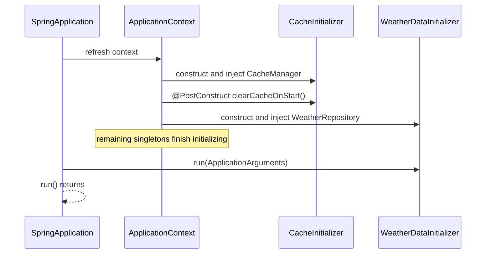

# ApplicationRunner

`ApplicationRunner` is a Spring Boot startup callback. After the container has created and initialized every singleton bean, Spring Boot finds beans that implement this interface and calls `run`. That call happens after the application has started and before `SpringApplication.run(...)` returns.

`@Component` only registers the class as a bean. The `implements ApplicationRunner` is what schedules `run` at the end of startup. A class that implements the interface but is not a bean is never called.

## In this project

`WeatherDataInitializer` seeds the `weather` table when it is empty:

```java
@Component
public class WeatherDataInitializer implements ApplicationRunner {

    private final WeatherRepository weatherRepository;

    public WeatherDataInitializer(WeatherRepository weatherRepository) {
        this.weatherRepository = weatherRepository;
    }

    @Override
    public void run(ApplicationArguments args) {
        if (weatherRepository.count() > 0) {
            return;
        }
        weatherRepository.save(weather("Bangalore", 28.5, 65, "Cloudy"));
        weatherRepository.save(weather("Mysore", 30.2, 60, "Sunny"));
        weatherRepository.save(weather("Hubli", 32.8, 55, "Partly Cloudy"));
    }
}
```

`run` receives `ApplicationArguments`, the parsed form of the arguments passed to `main`. Option names, option values, and non-option arguments are available through that object. This initializer ignores them and uses the callback only as a moment when `WeatherRepository` is ready.

## Where it sits in startup

`@PostConstruct` belongs to one bean. Spring calls it after that bean's own dependencies are injected, while other beans may still be initializing. See [Bean lifecycle](bean-lifecycle.md).

`ApplicationRunner` belongs to the application. Spring Boot calls it only after every singleton is in use, so the method can use repositories, caches, and other beans safely.

Startup order in this application:

```text
Create CacheInitializer
  → inject CacheManager
  → @PostConstruct: clear every cache
  → finish initializing the other singleton beans
  → WeatherDataInitializer.run(): insert sample rows when the table is empty
  → SpringApplication.run(...) returns
```



Several runners can exist in one application. Implement `Ordered` or add `@Order` to set their sequence. A lower order value runs first. Runners with no order run last.

If `run` throws, startup fails and `SpringApplication.run(...)` does not return normally.

## CommandLineRunner

`CommandLineRunner` is the same kind of callback. Its method is `run(String... args)` and receives the raw arguments from `main`. `ApplicationRunner` receives those arguments already parsed as `ApplicationArguments`. Spring Boot calls both kinds of beans in one ordered list.
