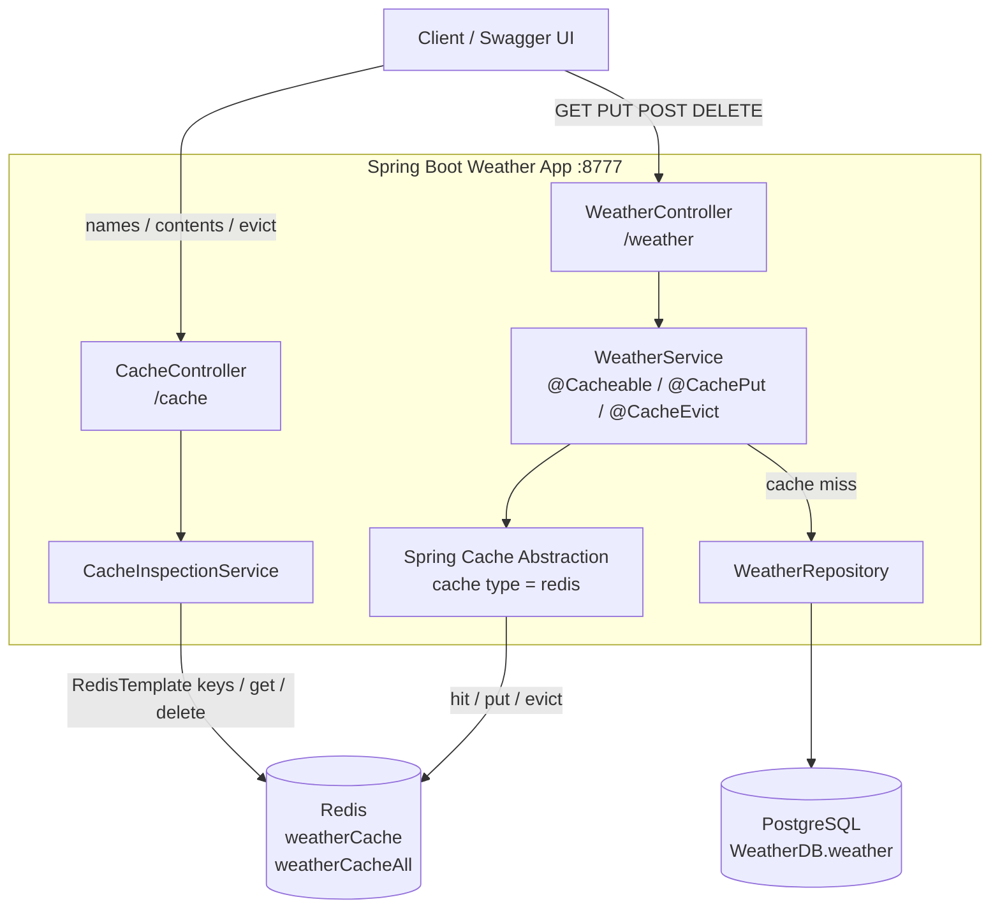

# Architecture

Clients call two REST surfaces. Weather reads and writes go through Spring Cache (`@Cacheable`, `@CachePut`, `@CacheEvict`) and land in Redis. A cache miss falls through to PostgreSQL. Cache inspection talks to Redis directly.



**Read path.** `GET /weather/{city}` is cached in `weatherCache` with the city as the key. A hit returns from Redis. A miss loads the row from PostgreSQL and stores it as `weatherCache::{city}`. `GET /weather` uses `weatherCacheAll`.

**Write path.** `POST` and `PUT` refresh `weatherCache` with `@CachePut`. `DELETE /weather/{city}` drops that key with `@CacheEvict`. Startup clears both caches via `CacheInitializer`.

How long an entry stays in Redis is covered in [Redis lifetime and memory limits](redis-limits.md). The two beans that set Redis serialization, TTL, and direct Redis access are in [Cache configuration beans](cache-config.md).

## Technologies

| Technology | Purpose |
|---|---|
| Spring Boot | Framework for backend services |
| Spring Cache abstraction | Caching annotations and `CacheManager` |
| Redis | Cache store for this application |
| Spring Data Redis | Redis integration with Spring |
| Swagger (OpenAPI) | API documentation |
| PostgreSQL | Database for persistent storage |

## Project structure

```
├── src/main/java/com/weather
│   ├── controller/       # REST controllers
│   ├── service/          # Business logic layer
│   ├── entity/           # Data model
│   ├── repository/       # Data access layer
│   ├── config/           # Configuration files
│   ├── WeatherApplication.java   # Main application entry point
```
