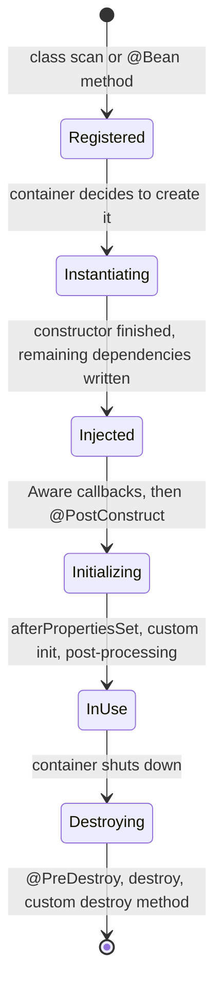

# Spring beans and their lifecycle

A bean is an ordinary Java object whose creation, injection, initialization, and destruction are owned by the Spring container. The class does not change type. `CacheInitializer` is still `CacheInitializer`. What changes is who calls `new`, who holds the instance, and when its callbacks run.

The container keeps a bean definition for each bean: which class or factory method to use, which constructor arguments to inject, whether the scope is singleton, and which init and destroy callbacks exist. At startup it registers those definitions, then creates instances in dependency order. Other components receive the container's instance (one shared instance for the default singleton scope).

## `@Component` and `@Bean`

`@Component` and `@Bean` are two ways to register a bean definition. The object that ends up in the container is the bean in both cases.

| | `@Component` | `@Bean` |
|---|---|---|
| Written on | A class you own | A method inside a `@Configuration` class |
| How Spring creates it | Calls the class constructor | Calls the method and stores the return value |
| Fits | Application types such as controllers and services | Third-party types, or objects that need hand-written setup |

`@Service`, `@Repository`, `@Controller`, and `@Configuration` are specialized forms of `@Component`. Component scan turns them into beans the same way, and the annotation name records the role. Which name this project uses on each class, and which names add behavior beyond registration, is covered in [Bean stereotypes](bean-stereotypes.md).

`CacheInitializer` is registered by annotation on the class:

```java
@Component
public class CacheInitializer {
```

`RedisTemplate` is registered by a factory method. The method is not the bean. The object it returns is. See [Cache configuration beans](cache-config.md).

```java
@Configuration
public class CacheConfig {

    @Bean
    public RedisTemplate<String, Object> redisTemplate(RedisConnectionFactory redisConnectionFactory) {
```

## Lifecycle of one singleton bean

For a singleton, the container moves the object through one forward chain: definition, instance, injected dependencies, initialization, use, destruction.



### Registered

The container has a definition only: class, constructor dependencies, and scope. No instance exists yet. Both `CacheInitializer` (`@Component`) and the `RedisTemplate` from a `@Bean` method wait here until startup creates the singletons.

### Instantiating

The container calls the constructor. `CacheInitializer(CacheManager cacheManager)` runs here, so constructor arguments are injected as part of `new`. The result is a raw object. Init methods have not run.

### Injected

Dependencies that the constructor does not cover are applied here: field or setter `@Autowired`, and `@Value`. Types in this project mostly use constructor injection, so this step often does no extra work. The state still advances.

### Initializing

Dependencies are in place. The container then runs callbacks in this order:

1. `BeanNameAware`, `BeanClassLoaderAware`, `BeanFactoryAware`.
2. Other `Aware` callbacks, such as `ApplicationContextAware`, via `BeanPostProcessor`s that run before initialization.
3. `@PostConstruct`.
4. `InitializingBean.afterPropertiesSet()`.
5. A custom method named by `@Bean(initMethod = "...")`.
6. `BeanPostProcessor`s that run after initialization. AOP proxies are usually wrapped here, so the object stored in the container may be a proxy.

`@PostConstruct` is a Jakarta lifecycle annotation (it used to live in Java EE). Spring calls the annotated method once, after it has created the bean and finished dependency injection, and before the bean is published for use. In `CacheInitializer` that method is `clearCacheOnStart()`: `CacheManager` is already injected, and the application is not serving requests yet, so this is the point where startup clears every cache.

When one bean configures several init mechanisms and the method names differ, Spring calls them in the order above: `@PostConstruct`, then `afterPropertiesSet()`, then the custom init method. If the same method name is used for more than one mechanism, that method runs once.

### In use

The singleton is stored in the container's singleton pool. Later injections receive that same instance. It stays in this state until the container shuts down.

### Destroying

On shutdown the container runs destroy callbacks in this order:

1. `@PreDestroy`.
2. `DisposableBean.destroy()`.
3. A custom method named by `@Bean(destroyMethod = "...")`.

`CacheInitializer` has no destroy callback. On shutdown the container drops its reference and does no extra cleanup for that bean.

## Where this project hits the chain

`CacheInitializer` reaches the initializing state and runs `clearCacheOnStart()`. `WeatherDataInitializer` is also a `@Component`, so it goes through the same bean states. Its `run` method does not. That method comes from `ApplicationRunner`, which Spring Boot calls only after every singleton bean is already in use. The callback itself is covered in [ApplicationRunner](application-runner.md).

Startup order in this application:

```text
Create CacheInitializer
  → inject CacheManager
  → @PostConstruct: clear every cache
  → finish initializing the other singleton beans
  → WeatherDataInitializer.run(): insert sample rows when the table is empty
  → accept HTTP requests
```

`@PostConstruct` is a callback on one bean. It means that bean's own dependencies are ready. `ApplicationRunner` is an application startup callback. It means the singletons in the container are ready, so later startup work such as seeding `weather` can run.
